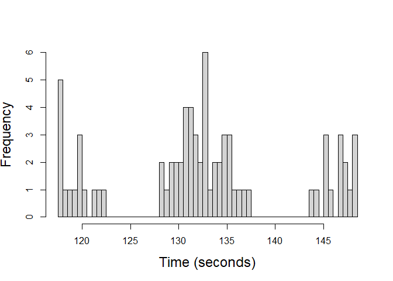
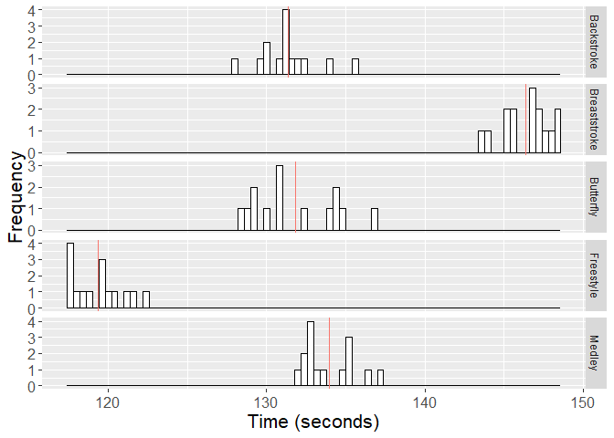
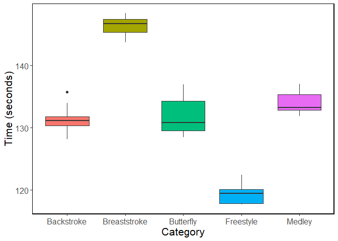
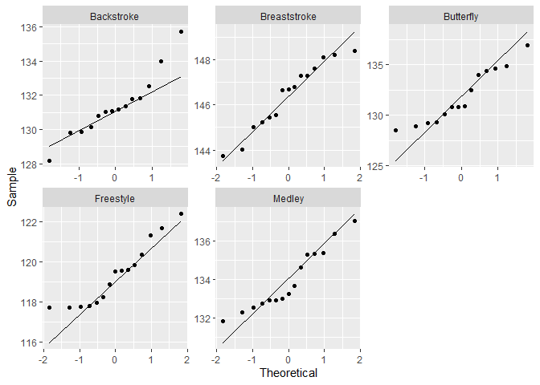
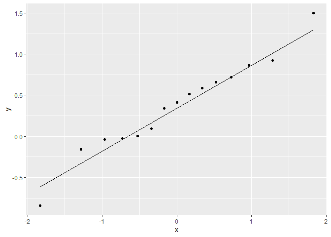

Comparison of multiple distributions
================
Fahad Deshmukh
01 08 2023

``` r
library(ggplot2)
library(dplyr)
```

    ## 
    ## Attaching package: 'dplyr'

    ## The following objects are masked from 'package:stats':
    ## 
    ##     filter, lag

    ## The following objects are masked from 'package:base':
    ## 
    ##     intersect, setdiff, setequal, union

``` r
# Read data
df <- read.csv("D:/multiple-distributions/Data/SwimmingTimes.csv")
```

``` r
str(df)
```

    ## 'data.frame':    80 obs. of  3 variables:
    ##  $ Category: chr  "Backstroke" "Backstroke" "Backstroke" "Backstroke" ...
    ##  $ Name    : chr  "SonneleOeztuerk" "AnastasyaGorbenko" "CamilaRodriguesRebelo" "DoraMolnar" ...
    ##  $ Time    : num  134 131 131 130 130 ...

``` r
# Change categorical variables to factors
df$Name <- as.factor(df$Name)
df$Category <- as.factor(df$Category)
str(df)
```

    ## 'data.frame':    80 obs. of  3 variables:
    ##  $ Category: Factor w/ 5 levels "Backstroke","Breaststroke",..: 1 1 1 1 1 1 1 1 1 1 ...
    ##  $ Name    : Factor w/ 73 levels "AfricaZamoranoSanz",..: 67 10 16 21 41 17 52 22 25 30 ...
    ##  $ Time    : num  134 131 131 130 130 ...

``` r
# Summary statistics
summary(df)
```

    ##          Category                 Name         Time      
    ##  Backstroke  :16   AnastasyaGorbenko: 2   Min.   :117.4  
    ##  Breaststroke:16   KatieShanahan    : 2   1st Qu.:129.3  
    ##  Butterfly   :16   KatinkaHosszu    : 2   Median :132.4  
    ##  Freestyle   :16   KristynaHorska   : 2   Mean   :132.6  
    ##  Medley      :16   LauraLahtinen    : 2   3rd Qu.:135.5  
    ##                    MarritSteenbergen: 2   Max.   :148.4  
    ##                    (Other)          :68

``` r
# Get the maximum number of Name count
max(table(df$Name))
```

    ## [1] 2

``` r
# Swimmers which competed in two different categories
tbl <- as.data.frame(table(df$Name))
bi_swimmmers <- tbl[tbl$Freq>1,]$Var1

# Subset dataframe to get only the data of swimmers which competed twice
bi_swimmmers_df <- df[df$Name %in% bi_swimmmers,]
bi_swimmmers_df[order(bi_swimmmers_df$Name),]
```

    ##        Category                 Name   Time
    ## 2    Backstroke    AnastasyaGorbenko 131.46
    ## 76       Medley    AnastasyaGorbenko 132.91
    ## 5    Backstroke        KatieShanahan 129.82
    ## 67       Medley        KatieShanahan 131.84
    ## 34    Butterfly        KatinkaHosszu 134.54
    ## 77       Medley        KatinkaHosszu 132.52
    ## 19 Breaststroke       KristynaHorska 145.55
    ## 69       Medley       KristynaHorska 132.99
    ## 24 Breaststroke        LauraLahtinen 147.60
    ## 42    Butterfly        LauraLahtinen 131.41
    ## 51    Freestyle    MarritSteenbergen 117.40
    ## 70       Medley    MarritSteenbergen 132.31
    ## 33    Butterfly MireiaBelmonteGarcia 134.01
    ## 79       Medley MireiaBelmonteGarcia 135.47

``` r
# As there are some swimmers who competed in two different categories we will remove them from one competition. By doing so we will have each swimmer only once in the data set.   
df <- df[-c(2,5,34,19,42,51,79),]
```

``` r
# New Category sizes
summary(df)
```

    ##          Category                      Name         Time      
    ##  Backstroke  :14   AfricaZamoranoSanz    : 1   Min.   :117.7  
    ##  Breaststroke:15   AinhoCampabadalAmezcua: 1   1st Qu.:129.2  
    ##  Butterfly   :14   AlbaVazquezRuiz       : 1   Median :132.5  
    ##  Freestyle   :15   AleksandraPolanska    : 1   Mean   :132.6  
    ##  Medley      :15   AliceMizzau           : 1   3rd Qu.:135.7  
    ##                    AminaKajtaz           : 1   Max.   :148.4  
    ##                    (Other)               :67

``` r
# Histogram
hist(df$Time, breaks = 50, main = "", xlab = "Time (seconds)", ylab="Frequency", cex.lab = 1.5)
```

<!-- -->

``` r
# Choice of a good width?
# Label Size?
```

``` r
# Histogram for each Category
library(plyr)
```

    ## ------------------------------------------------------------------------------

    ## You have loaded plyr after dplyr - this is likely to cause problems.
    ## If you need functions from both plyr and dplyr, please load plyr first, then dplyr:
    ## library(plyr); library(dplyr)

    ## ------------------------------------------------------------------------------

    ## 
    ## Attaching package: 'plyr'

    ## The following objects are masked from 'package:dplyr':
    ## 
    ##     arrange, count, desc, failwith, id, mutate, rename, summarise,
    ##     summarize

``` r
mu <- ddply(df, "Category", summarise, grp.mean=mean(Time))

p <- ggplot(df, aes(x=Time)) +
  geom_histogram(color="black", fill="white", binwidth = 0.4) +
  facet_grid(Category ~ ., scales="free_y") +
  theme(axis.text=element_text(size=12), 
        axis.title=element_text(size=16),
        legend.text=element_text(size=12)) +
  theme(legend.position='none') +
  labs(x="Time (seconds)", y = "Frequency") 
  # Add mean lines
  p + geom_vline(data=mu, aes(xintercept=grp.mean, color="red"), linetype="solid")
```

<!-- -->

``` r
# Boxplot of each category
df %>% 
  ggplot(aes(factor(Category), Time, fill = factor(Category))) +
  geom_boxplot() +
  theme(panel.spacing = unit(0, "lines"),
        panel.border = element_rect(fill = NA),
        strip.background = element_blank(),
        #axis.title.x = element_blank(),
        legend.position = "none",
        strip.placement = "outside") +
  theme(panel.background = element_blank()) +
  theme(axis.line = element_line(colour = "black")) +
  theme(panel.border = element_rect(color = "black", fill = NA, size = 1)) +
  theme(legend.position='none') +
  labs(y="Time (seconds)", x = "Category") +
  theme(axis.text=element_text(size=12), 
        axis.title=element_text(size=16),
        legend.text=element_text(size=12))
```

    ## Warning: The `size` argument of `element_rect()` is deprecated as of ggplot2 3.4.0.
    ## ℹ Please use the `linewidth` argument instead.

<!-- -->

``` r
# Color? Should we use black (the same color) for all boxes?
```

``` r
# Mean of each category
hm <- setNames(aggregate(df$Time, by=list(df$Category), FUN=mean), c("Category", "Mean")) 

# Variance of each category
hm$Variance <- tapply(df$Time, df$Category, FUN = var)

# Standard Deviation of each category
hm$`Standard Deviation` <- tapply(df$Time, df$Category, FUN = sd)

hm 
```

    ##       Category     Mean Variance Standard Deviation
    ## 1   Backstroke 131.3800 3.426738           1.851145
    ## 2 Breaststroke 146.4000 2.222114           1.490676
    ## 3    Butterfly 131.8421 7.205280           2.684265
    ## 4    Freestyle 119.3580 2.429803           1.558782
    ## 5       Medley 133.9447 2.548627           1.596442

## Assumption (Normality)

``` r
# qqplots for normality check
ggplot(df, aes(sample = Time)) +
  stat_qq() +
  stat_qq_line() +
  facet_wrap(~Category, scales = "free") +
  labs(y="Sample", x = "Theoretical")
```

<!-- -->

Since the sample values generally match the theoretical values, we
conclude that the time values in each category are normally distributed.
Therefore, we can say that the values in each group are normally
distributed and the normality assumption is satisfied.

``` r
# !!! OPTIONAL !!!
#generate vector of 15 values that follow standard normal distribution
data <- rnorm(15)
data <- as.data.frame(data)
ggplot(data, aes(sample = data)) +
  stat_qq() +
  stat_qq_line()
```

<!-- -->

We see that simulated normally distributed random values have similar
pattern as the ones obtained with the sample values.

``` r
# !!! not included in analysis (optional) !!!
# Shapiro test for normality check
shapiro.test(df[df$Category=="Backstroke",]$Time)
```

    ## 
    ##  Shapiro-Wilk normality test
    ## 
    ## data:  df[df$Category == "Backstroke", ]$Time
    ## W = 0.93735, p-value = 0.3854

``` r
shapiro.test(df[df$Category=="Breaststroke",]$Time)
```

    ## 
    ##  Shapiro-Wilk normality test
    ## 
    ## data:  df[df$Category == "Breaststroke", ]$Time
    ## W = 0.94084, p-value = 0.3931

``` r
shapiro.test(df[df$Category=="Butterfly",]$Time)
```

    ## 
    ##  Shapiro-Wilk normality test
    ## 
    ## data:  df[df$Category == "Butterfly", ]$Time
    ## W = 0.91633, p-value = 0.1947

``` r
shapiro.test(df[df$Category=="Freestyle",]$Time)
```

    ## 
    ##  Shapiro-Wilk normality test
    ## 
    ## data:  df[df$Category == "Freestyle", ]$Time
    ## W = 0.89706, p-value = 0.08584

``` r
shapiro.test(df[df$Category=="Medley",]$Time)
```

    ## 
    ##  Shapiro-Wilk normality test
    ## 
    ## data:  df[df$Category == "Medley", ]$Time
    ## W = 0.91232, p-value = 0.147

# Assumption (Homogeneity)

``` r
# Standard Deviation of each category
hm <- setNames(aggregate(df$Time, by=list(df$Category), FUN=sd), c("Category", "Standard Deviation")) 

# Variance of each category
hm$Variance <- tapply(df$Time, df$Category, FUN = var)

hm
```

    ##       Category Standard Deviation Variance
    ## 1   Backstroke           1.851145 3.426738
    ## 2 Breaststroke           1.490676 2.222114
    ## 3    Butterfly           2.684265 7.205280
    ## 4    Freestyle           1.558782 2.429803
    ## 5       Medley           1.596442 2.548627

The variance and the standard deviation of each category is similar. The
category Butterfly have higher variability but the difference is not
big. Hence, we can say that the variance of the categories are the same
and the homogeneity assumption is satisfied.

``` r
# !!! OPTIONAL !!!
library(car)
# Levene's test with one independent variable
leveneTest(Time ~ Category, data = df)
```

    ## Levene's Test for Homogeneity of Variance (center = median)
    ##       Df F value Pr(>F)
    ## group  4  1.6154 0.1804
    ##       68

# Assumption (Independence)

It was actually violated if had used the whole data set, as there were
the same swimmers in different groups. To handle this issue we removed
the 7 observations where the same swimmer competed in another category
as well. The selection of the observations are made in a way to keep the
group sizes close to each other. There were 6 swimmers who competed in
medley in addition to another category. This was taken into
consideration.

As all three assumptions are satisfied (Normality, Homogeneity,
Independence) we can use the One-way ANOVA test.

# Parametric Test (One-way ANOVA)

``` r
# One-way ANNOVA
res_aov <- aov(Time ~ Category, data = df)
summary(res_aov)
```

    ##             Df Sum Sq Mean Sq F value Pr(>F)    
    ## Category     4   5543  1385.7   394.2 <2e-16 ***
    ## Residuals   68    239     3.5                   
    ## ---
    ## Signif. codes:  0 '***' 0.001 '**' 0.01 '*' 0.05 '.' 0.1 ' ' 1

The obtained p-value is significantly small at the significance level
$alpha$ = 0.05. Hence, we reject the null hypothesis (All categories
have the same mean value), and we conclude that at least one category
has significantly different mean value than others. Now, we will check
the pairwise differences using pairwise t-tests.

First, we do pairwise t-tests without any adjustment for multiple
testing.

``` r
# No adjustment
pairwise.t.test(df$Time, df$Category, p.adjust.method = "none")
```

    ## 
    ##  Pairwise comparisons using t tests with pooled SD 
    ## 
    ## data:  df$Time and df$Category 
    ## 
    ##              Backstroke Breaststroke Butterfly Freestyle
    ## Breaststroke < 2e-16    -            -         -        
    ## Butterfly    0.51649    < 2e-16      -         -        
    ## Freestyle    < 2e-16    < 2e-16      < 2e-16   -        
    ## Medley       0.00046    < 2e-16      0.00358   < 2e-16  
    ## 
    ## P value adjustment method: none

Except the pair Butterfly-Backstroke (0.516), all pairwise tests result
is significantly (at 0.05 significance level) small p-values. Except
Butterfly-Backstroke all category pairs have significantly different
mean values. However for the Butterfly-Backstroke we fail to reject the
null hypothesis (Butterfly and Backstroke categories have the same mean
value) and conclude that there is no significant evidence to say these
two categories have different mean values.

However, as we use the same data set for multiple tests we need to
adjust the testing procedure accordingly. For this purpose we use two
different adjustment methods, “bonferroni” and “holm”.

``` r
# "bonferroni" adjustment (more conservative)
pairwise.t.test(df$Time, df$Category, p.adjust.method = "bonferroni")
```

    ## 
    ##  Pairwise comparisons using t tests with pooled SD 
    ## 
    ## data:  df$Time and df$Category 
    ## 
    ##              Backstroke Breaststroke Butterfly Freestyle
    ## Breaststroke <2e-16     -            -         -        
    ## Butterfly    1.0000     <2e-16       -         -        
    ## Freestyle    <2e-16     <2e-16       <2e-16    -        
    ## Medley       0.0046     <2e-16       0.0358    <2e-16   
    ## 
    ## P value adjustment method: bonferroni

With bonferroni adjustment method we obtain p-values which are still
significantly small (alpha = 0.05) for all pairs except
Butterfly-Backstroke (1.0000). Hence, the conclusions remains the same.
Now, we use the “holm” method for adjustment which is less conservative
than the “bonferroni” method.

``` r
# "holm" adjustment ->  less conservative
pairwise.t.test(df$Time, df$Category, p.adjust.method = "holm")
```

    ## 
    ##  Pairwise comparisons using t tests with pooled SD 
    ## 
    ## data:  df$Time and df$Category 
    ## 
    ##              Backstroke Breaststroke Butterfly Freestyle
    ## Breaststroke <2e-16     -            -         -        
    ## Butterfly    0.5165     <2e-16       -         -        
    ## Freestyle    <2e-16     <2e-16       <2e-16    -        
    ## Medley       0.0014     <2e-16       0.0072    <2e-16   
    ## 
    ## P value adjustment method: holm

We again obtain significantly (alpha = 0.05) small p-values for all
pairs except Butterfly-Backstroke (0.5165). The conclusions remain the
same. We fail to reject the null hypothesis (The mean values are the
same) for the pair Butterfly-Backstroke and say there is no enough
evidence to say both categories are different. However, for all other
pairs we reject the null hypothesis and conclude that the categories in
the pairs are significantly different from each other.

``` r
df.Backstroke<-filter(df,Category=='Backstroke')
df.Breaststroke<-filter(df,Category=='Breaststroke')
df.Butterfly<-filter(df,Category=='Butterfly')
df.Freestyle<-filter(df,Category=='Freestyle')
df.Medley<-filter(df,Category=='Medley')
```

``` r
summary(df.Backstroke)
```

    ##          Category                     Name        Time      
    ##  Backstroke  :14   AfricaZamoranoSanz   :1   Min.   :128.2  
    ##  Breaststroke: 0   AvivBarzelay         :1   1st Qu.:130.3  
    ##  Butterfly   : 0   CamilaRodriguesRebelo:1   Median :131.1  
    ##  Freestyle   : 0   CarmenWeilerSastre   :1   Mean   :131.4  
    ##  Medley      : 0   DoraMolnar           :1   3rd Qu.:131.8  
    ##                    EmmaTerebo           :1   Max.   :135.7  
    ##                    (Other)              :8

``` r
IQR(df.Backstroke$Time)
```

    ## [1] 1.5175

``` r
summary(df.Breaststroke)
```

    ##          Category                   Name        Time      
    ##  Backstroke  : 0   AnaBlazevic        :1   Min.   :143.7  
    ##  Breaststroke:15   BenteFischer       :1   1st Qu.:145.3  
    ##  Butterfly   : 0   ClaraRybak-Andersen:1   Median :146.7  
    ##  Freestyle   : 0   FrancescaFangio    :1   Mean   :146.4  
    ##  Medley      : 0   JessicaVallMontero :1   3rd Qu.:147.4  
    ##                    KaraHanlon         :1   Max.   :148.4  
    ##                    (Other)            :9

``` r
summary(df.Butterfly)
```

    ##          Category                   Name        Time      
    ##  Backstroke  : 0   AminaKajtaz        :1   Min.   :128.5  
    ##  Breaststroke: 0   AnaCatarinaMonteiro:1   1st Qu.:129.5  
    ##  Butterfly   :14   AnastasiaTichy     :1   Median :130.8  
    ##  Freestyle   : 0   AnninaFatmaGrabher :1   Mean   :131.8  
    ##  Medley      : 0   AntonellaCrispino  :1   3rd Qu.:134.3  
    ##                    FannyBorer         :1   Max.   :136.9  
    ##                    (Other)            :8

``` r
IQR(df.Butterfly$Time)
```

    ## [1] 4.8

``` r
summary(df.Freestyle)
```

    ##          Category                      Name        Time      
    ##  Backstroke  : 0   AinhoCampabadalAmezcua:1   Min.   :117.7  
    ##  Breaststroke: 0   AleksandraPolanska    :1   1st Qu.:117.9  
    ##  Butterfly   : 0   AliceMizzau           :1   Median :119.5  
    ##  Freestyle   :15   AntoniettaCesarano    :1   Mean   :119.4  
    ##  Medley      : 0   CharlotteBonnet       :1   3rd Qu.:120.1  
    ##                    FreyaAnderson         :1   Max.   :122.4  
    ##                    (Other)               :9

``` r
summary(df.Medley)
```

    ##          Category                 Name        Time      
    ##  Backstroke  : 0   AlbaVazquezRuiz  :1   Min.   :131.8  
    ##  Breaststroke: 0   AnastasyaGorbenko:1   1st Qu.:132.8  
    ##  Butterfly   : 0   DalmaSebestyen   :1   Median :133.3  
    ##  Freestyle   : 0   FrancescaFresia  :1   Mean   :133.9  
    ##  Medley      :15   FreyaColbert     :1   3rd Qu.:135.3  
    ##                    KatieShanahan    :1   Max.   :137.0  
    ##                    (Other)          :9
